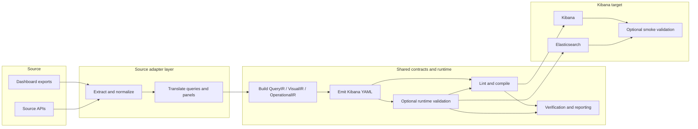

# Observability Migration Architecture

This is the repo-level architecture overview. Use it as the entry point for the
current package layout, runtime surfaces, and contributor reading order.

For the docs index, read `docs/README.md`. For the shared pipeline overview,
read `docs/pipeline-trace.md`. For source-specific traces, read
`docs/sources/grafana-trace.md` and `docs/sources/datadog-trace.md`. For the
canonical asset contracts, read `docs/architecture/asset-model.md`.

## Design Principles

1. **Source adapters in, shared target runtime out.**
2. Raw vendor JSON stays in adapter packages; shared code consumes typed contracts and result objects.
3. Query translation should stay deterministic by default, with rule packs and plugins extending behavior cleanly.
4. Validation, reporting, and runtime evidence should make semantic risk explicit instead of hiding it.
5. The current target is Kibana, but the source/target boundaries are kept explicit for future extension.

## Naming And Runtime Surfaces

The repo uses three related names:

- **Product / docs name**: Observability Migration Platform
- **Installable distribution**: `obs-migrate`
- **Importable Python package**: `observability_migration`

Current runtime surfaces:

| Surface | Entry point | Purpose |
|---|---|---|
| Unified CLI | `.venv/bin/obs-migrate` or `python -m observability_migration` | Source-agnostic CLI with `migrate`, `compile`, `upload`, `cluster`, and `extensions` subcommands |
| Grafana CLI | `.venv/bin/grafana-migrate` or `python -m observability_migration.adapters.source.grafana.cli` | Full Grafana migration pipeline |
| Datadog CLI | `.venv/bin/datadog-migrate` or `python -m observability_migration.adapters.source.datadog.cli` | Datadog extraction, preflight, translation, report, and optional compile |
| Grafana smoke validator | `.venv/bin/grafana-validate-uploaded` or `python -m observability_migration.adapters.source.grafana.validate_uploaded_dashboards` | Post-upload Kibana saved-object validation |
| Grafana corpus generator | `.venv/bin/grafana-generate-corpus` or `python -m observability_migration.adapters.source.grafana.corpus` | Synthetic metrics/log generation for validation gaps |

## Current Target Model

The repo can run against any Elasticsearch + Kibana pair, but the main target
is Elastic Serverless.

That changes the preferred Grafana translation branch:

- compatible PromQL panels prefer native `PROMQL` when `--native-promql` is enabled
- LogQL panels still translate to ES|QL against the configured logs index
- source-native ES|QL can be reused directly
- the local OTLP lab is a repeatable stand-in for local development and CI, not the primary production target

## End-To-End Flow



Generated artifacts typically include:

- `yaml/*.yaml`
- `compiled/*/compiled_dashboards.ndjson`
- `migration_report.json`
- `migration_manifest.json`
- `rollout_plan.json`
- `verification_packets.json` for Grafana and Datadog runs
- `preflight_report.json` and `required_target_contract.json` in Grafana preflight mode
- `upload_smoke_report.json` or `uploaded_dashboard_smoke_report.json` from smoke validation

## Package Map

| Path | Responsibility |
|---|---|
| `observability_migration/app/cli.py` | Unified CLI bootstrap and source dispatch |
| `observability_migration/adapters/source/grafana/adapter.py` | Registers the Grafana source adapter |
| `observability_migration/adapters/source/grafana/cli.py` | Grafana end-to-end orchestration |
| `observability_migration/adapters/source/grafana/extract.py` | Grafana file/API extraction |
| `observability_migration/adapters/source/grafana/panels.py` | Panel and dashboard translation, layout normalization, YAML generation |
| `observability_migration/adapters/source/grafana/translate.py` | PromQL / LogQL translation entry points |
| `observability_migration/adapters/source/grafana/promql.py` | PromQL parsing and planning helpers |
| `observability_migration/adapters/source/grafana/rules.py` | Rule registries, rule packs, plugins |
| `observability_migration/adapters/source/grafana/schema.py` | Elasticsearch field resolution |
| `observability_migration/adapters/source/grafana/esql_validate.py` | Target-side query validation and safe rewrites |
| `observability_migration/adapters/source/grafana/preflight.py` | Readiness checks and preflight report generation |
| `observability_migration/adapters/source/grafana/verification.py` | Verification packets and semantic gates |
| `observability_migration/adapters/source/grafana/smoke.py` | Post-upload saved-object validation and browser audit |
| `observability_migration/adapters/source/grafana/corpus.py` | Synthetic corpus generation |
| `observability_migration/adapters/source/datadog/adapter.py` | Registers the Datadog source adapter |
| `observability_migration/adapters/source/datadog/cli.py` | Datadog orchestration and reporting |
| `observability_migration/adapters/source/datadog/normalize.py` | Normalized Datadog dashboard shape |
| `observability_migration/adapters/source/datadog/planner.py` | Widget planning |
| `observability_migration/adapters/source/datadog/query_parser.py` and `log_parser.py` | Datadog metric/log parsing |
| `observability_migration/adapters/source/datadog/translate.py` | Widget translation |
| `observability_migration/adapters/source/datadog/field_map.py` | Built-in field profiles and custom profile loading |
| `observability_migration/adapters/source/datadog/execution.py` | Live Datadog metric source execution for verification |
| `observability_migration/adapters/source/datadog/manifest.py` and `rollout.py` | Datadog manifest and rollout artifacts |
| `observability_migration/core/assets/` | Canonical asset contracts such as `DashboardIR`, `PanelIR`, `QueryIR`, `VisualIR`, and `OperationalIR` |
| `observability_migration/core/interfaces/` | Source/target adapter ABCs and registries |
| `observability_migration/core/reporting/report.py` | Shared result dataclasses and report helpers |
| `observability_migration/core/verification/comparators.py` | Comparator helpers and verification support types |
| `observability_migration/targets/kibana/emit/` | Shared Kibana YAML emission helpers |
| `observability_migration/targets/kibana/compile.py` | Shared compile, upload, lint, layout-validation, and YAML-sync helpers |

## Architecture By Layer

### Unified CLI And Adapter Registry

`observability_migration/app/cli.py` is the source-agnostic entry point. It
imports the registered adapters, exposes `migrate`, `compile`, `upload`,
`cluster`, and `extensions`, and dispatches to the dedicated Grafana or
Datadog workflows.

For live extraction, unified `migrate --input-mode api` dispatches into the
source-specific API extractors. The unified CLI currently parses `--include`,
but Grafana and Datadog handlers do not use it as source-asset selection in
either `files` or `api` mode.

### Source Adapters

Grafana is the most complete source path today. It owns:

- extraction from files and the Grafana API for dashboard documents
- PromQL / LogQL translation
- variable/control translation
- derived reviewer artifacts for links, annotations, transformations, and legacy alerts from dashboard JSON
- preflight readiness checks
- verification packets and semantic gates
- optional upload and post-upload smoke validation

Datadog currently covers:

- extraction from files and the Datadog API for dashboard objects
- dashboard normalization
- metric-query, formula, and log-search translation
- YAML generation plus manifest and rollout outputs
- capability-aware preflight via `--preflight` and/or live `_field_caps` loaded by `--es-url`
- first-class emitted-query validation
- optional shared compile via `--compile`
- first-class upload in the dedicated Datadog CLI or via `obs-migrate upload`
- post-upload smoke validation and verification packets
- live Datadog metric source execution during verification when credentials are configured
- Datadog monitors are first-class live inputs for alert migration, but broader non-dashboard Datadog product surfaces remain out of scope

### Source Adapter Pipelines

The shared architecture is common, but the dedicated source CLIs do **not** run
the same stage sequence.

| Stage | Grafana dedicated pipeline | Datadog dedicated pipeline |
|---|---|---|
| Runtime setup | Load rule packs/plugins, configure dataset filters, build `SchemaResolver`, optionally auto-enable `--validate` for upload/preflight | Load field profile, derive dataset filters, optionally load live `_field_caps` into the field map, and auto-enable `--validate` for upload when `--es-url` is present |
| Extract | `extract_dashboards_from_files()` or `extract_dashboards_from_grafana()` for dashboard documents; links/annotations/transforms/legacy alerts are derived later from dashboard JSON | `extract_dashboards_from_files()` or `extract_dashboards_from_api()` for dashboard objects; monitors stay out of scope as first-class live inputs |
| Normalize | Mostly folded into dashboard/panel translation and layout handling | Explicit `normalize_dashboard()` to `NormalizedDashboard` / `NormalizedWidget` before planning |
| Planning | Translation path chosen inside Grafana panel/query flow: native `PROMQL`, rule-engine ES|QL, LLM fallback, or native ES|QL reuse | Explicit `plan_widget()` chooses `lens`, `esql`, `esql_with_kql`, `markdown`, `group`, or `blocked` |
| Translate | `translate_dashboard()` handles queries, panel mapping, controls, layout, and initial YAML emission | `translate_widget()` runs after planning; YAML is emitted later by `generate_dashboard_yaml()` |
| Preflight / capability safety | Customer-facing preflight mode plus source/target probes; validation can be auto-enabled | Capability-aware preflight runs before translation when `--preflight` or live field capabilities are available |
| Target query validation | First-class `--validate --es-url` loop with auto-fix/manualize and YAML sync | First-class `--validate --es-url` loop with shared ES query fixes plus Datadog-safe YAML regeneration/manualization |
| Compile / layout | YAML lint, compile, and compiled-layout validation are part of the main Grafana flow | Optional shared compile via `--compile`, after any validation-driven YAML rewrites |
| Upload | First-class `--upload` in the dedicated CLI after lint/compile/layout pass | First-class `--upload` in the dedicated CLI after compile; shared `obs-migrate upload` remains available |
| Smoke / verification | Optional smoke-report merge plus verification packets and semantic gates in the main flow | First-class `--smoke`, semantic gates, and live metric source execution during verification when configured |
| Reports | `migration_report.json`, `migration_manifest.json`, `verification_packets.json`, optional preflight artifacts, rollout plan | `migration_report.json`, `migration_manifest.json`, `verification_packets.json`, `rollout_plan.json`, optional smoke report |

#### Grafana Dedicated Flow

The dedicated Grafana CLI behaves like this:

```text
rule packs/plugins/schema setup
  -> extract dashboards
  -> translate_dashboard() and emit YAML
  -> optional metadata polish
  -> optional ES query validation and YAML sync
  -> YAML lint
  -> compile and layout validation
  -> optional upload
  -> optional integrated smoke validation / browser audit / screenshot capture
  -> verification packets and reviewer explanations
  -> report / manifest
  -> optional preflight probes and contract report
  -> rollout plan
```

Important detail: Grafana's "translation" stage is broad. It already includes
query-path selection, variable/control translation, layout normalization, YAML
emission, and feature-gap artifact extraction for links, annotations,
transformations, and legacy alerts.

#### Datadog Dedicated Flow

The dedicated Datadog CLI behaves like this:

```text
field profile setup
  -> optional live target field-capability discovery
  -> extract dashboards
  -> normalize_dashboard()
  -> optional capability-aware preflight
  -> plan_widget()
  -> translate_widget()
  -> generate_dashboard_yaml()
  -> optional emitted-query validation
  -> optional compile
  -> optional upload
  -> optional smoke validation
  -> verification packets
  -> report
```

Important detail: Datadog has a more explicit **normalize -> plan -> translate
-> emit** pipeline than Grafana, and it now continues through first-class
validate/compile/upload/smoke/verification steps. Datadog also produces
`migration_manifest.json` and `rollout_plan.json` artifacts, and runs live
metric source execution during verification when API credentials are available.
The remaining breadth gap is log-query and multi-query source execution, which
still fall back to target/runtime evidence.

### Shared Contracts And Result Objects

The repo uses a mix of typed IRs and report/result objects:

- `DashboardIR`, `PanelIR`, `QueryIR`, `TargetQueryPlan`, `VisualIR`, and `OperationalIR` live under `core/assets/`
- `MigrationResult` and `PanelResult` live in `core/reporting/report.py`
- `VisualIR` is a derived snapshot of emitted YAML, not the source of truth
- `OperationalIR` is refreshed after verification with the final semantic gate and runtime state

### Kibana Target Runtime

The shared target runtime is centered on `targets/kibana/`:

- `emit/` builds YAML panel shapes and display metadata
- `adapter.py` registers the real Kibana `TargetAdapter` used by `obs-migrate compile/upload` and the Datadog smoke path
- `compile.py` wraps `uvx kb-dashboard-cli`, YAML lint, compiled-layout validation, upload helpers, and post-validation YAML sync
- `smoke.py` inspects uploaded saved objects, runs ES|QL runtime checks, and supports browser audits/screenshots

Some runtime-validation behavior still lives in Grafana modules because it is
currently source-query aware:

- `grafana/esql_validate.py` validates emitted target queries against Elasticsearch
- `grafana/smoke.py` validates uploaded saved objects in Kibana

## Generated Evidence

The platform is intentionally evidence-heavy. Depending on the path and flags,
one run can produce:

- migration results and status counts
- detailed per-panel traces and warnings
- validation records and safe rewrite metadata
- verification packets with semantic gates
- rollout and preflight artifacts
- smoke-validation reports and optional screenshots

This is how the repo keeps risk explicit instead of hiding approximation behind
a single success/failure flag.

## Current Boundaries

The current architecture is intentionally honest about what is still partial:

- source-vs-target value comparison is not yet a full first-class workflow
- Datadog now has preflight plus first-class validate/compile/upload/smoke, migration manifest and rollout artifacts, and live metric source execution during verification. The main remaining parity gap is broader source execution coverage for logs and multi-query widgets.
- the active runtime is still partly CLI-centric, but Kibana is now wired through a registered `TargetAdapter` for shared compile/upload/smoke behavior
- some query families still degrade to warnings, placeholders, or manual review
- `VisualIR` is a snapshot of emitted YAML, not a full Grafana visual model
- emitted-query validation is shared in spirit but still partly source-specific in code layout

## Contributor Reading Order

1. `README.md` for runnable entry points and common workflows
2. `docs/README.md` for the docs index and quickest reading path
3. This file (`docs/architecture.md`) for the package layout, design principles, and layer boundaries
4. `docs/architecture/asset-model.md` for shared contracts
5. `docs/pipeline-trace.md` for the shared pipeline overview and cross-source summary
6. `docs/sources/grafana.md` or `docs/sources/datadog.md` for source-specific entry points, then `docs/sources/grafana-trace.md` or `docs/sources/datadog-trace.md` for real trace output
7. `observability_migration/app/cli.py` for the unified bootstrap
8. `observability_migration/adapters/source/grafana/cli.py` or `observability_migration/adapters/source/datadog/cli.py` for the active source path
9. `observability_migration/targets/kibana/compile.py` for shared compile/upload helpers
10. `scripts/full_local_demo.sh` (full and bundled sample local validation flows) and `scripts/setup_serverless_data.py` for operational flows

## Related Docs

| Path | Purpose |
|---|---|
| `docs/README.md` | Docs index |
| `docs/architecture/asset-model.md` | Canonical asset model |
| `docs/pipeline-trace.md` | Shared pipeline overview and cross-source summary |
| `docs/sources/grafana-trace.md` | Auto-generated Grafana per-dashboard traces |
| `docs/sources/datadog-trace.md` | Auto-generated Datadog per-dashboard traces |
| `docs/sources/grafana.md` | Grafana adapter details |
| `docs/sources/datadog.md` | Datadog adapter details |
| `docs/targets/kibana.md` | Shared Kibana target runtime |
| `docs/local-otlp-validation.md` | Local validation lab |
| `REMAINING-ROADMAP.md` | Current roadmap and highest-priority gaps |
